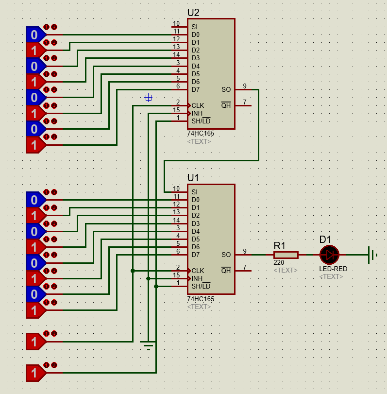

Mở rộng ngõ vào Input cho Arduino với IC 74HC165
#################################################

* **Thực hiện:** Thi Minh Nhựt - **Email:** thiminhnhut@gmail.com

* **Thời gian:** Ngày 05 tháng 08 năm 2018

.. sectnum::

.. contents:: Nội dung

Nội dung thực hiện
******************

Nguyên lý hoạt động của IC 74HC165
==================================

* Giải thích nguyên lý hoạt động của IC ghi dịch 74HC165: `Nguyên lý hoạt động của IC ghi dịch 74HC165. <https://github.com/thiminhnhut/Lop6/blob/master/10.Documents/ExpandDigitalInput_74HC165.pdf>`_

* Mô phỏng nguyên lý hoạt động của 1 IC ghi dịch 74HC165 với phần mềm Proteus: `Simulation_74HC165x1.pdsprj. <https://github.com/thiminhnhut/74hc165-arduino/blob/master/30.Schematic/Simulation_74HC165x1.pdsprj>`_

* Mô phỏng nguyên lý hoạt động của 1 IC ghi dịch 74HC165 với phần mềm Proteus: `Simulation_74HC165x2.pdsprj. <https://github.com/thiminhnhut/74hc165-arduino/blob/master/30.Schematic/Simulation_74HC165x2.pdsprj>`_

Giao tiếp giữa IC ghi dịch 74HC165 và Arduino
=============================================

* File mô phỏng với phần mềm Proteus: `Arduino_74HC165x1.pdsprj. <https://github.com/thiminhnhut/74hc165-arduino/blob/master/30.Schematic/Arduino_74HC165x1.pdsprj>`_

* Chương trình đọc dữ liệu từ IC ghi dịch 74HC165: `Arduino_74HC165x1 <https://github.com/thiminhnhut/74hc165-arduino/tree/master/20.Firmware/Arduino_74HC165x1>`_ (`src/main.cpp <https://github.com/thiminhnhut/74hc165-arduino/blob/master/20.Firmware/Arduino_74HC165x1/src/main.cpp>`_).
